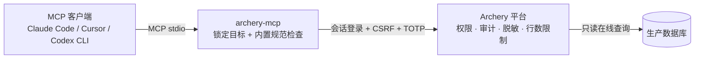

# archery-mcp

<!-- mcp-name: io.github.itzhouq/archery-mcp -->

[](https://github.com/itzhouq/archery-mcp/actions/workflows/ci.yml)
[](https://pypi.org/project/archery-mcp/)
[](https://pypi.org/project/archery-mcp/)
[](LICENSE)

> **Unofficial read-only MCP server for [Archery](https://github.com/hkadb/archery)** — let your AI coding agent inspect production table schema and validate release SQL through your own Archery platform, with permissions, row limits and data masking still enforced by Archery itself.

**中文**：archery-mcp 是一个 [MCP](https://modelcontextprotocol.io) Server，把 [Archery](https://github.com/hkadb/archery) SQL 审核平台的在线查询与 SQL 检查能力带给 AI 编码助手（Claude Code、Cursor、Codex CLI 等）。AI 在写代码时可以直接查看线上表结构、验证数据特征、检查上线 SQL 规范，而不需要你手动比对环境差异。

> [!IMPORTANT]
> - 本项目与 Archery 官方**无隶属关系**，是独立的非官方客户端；
> - 本项目按"现状"提供（MIT License）。使用者须**自行取得公司授权**并遵守公司数据安全规定，作者不对违规使用及其后果负责；
> - 安全模型：本 MCP **不在本地过滤 SQL 或遮蔽数据**，权限、行数上限、超时与脱敏完全由你自己的 Archery 平台执行——请给 MCP 配置专用的最小权限账号（见[安全模型](#安全模型与免责声明)）。

## 为什么做这个

日常迭代业务系统时，常见的三个痛点：

1. **test 和 prod 的表结构、索引可能不一致**。AI 拿着过时或想当然的表结构写代码、写上线脚本，错误要到上线前人工比对时才发现；
2. **上线脚本靠人工比对环境差异来写**。版本迭代需要 DDL/DML 时，你得手动 `DESC` 生产表、核对索引，再让 AI 照着写——重复、低效、易错；
3. **有些数据清洗依赖生产数据的真实特征**（脏数据分布、边界记录、字段实际取值），test 环境的数据无法完整呈现。

这些问题的共同解法是：**让 AI 在编码工作流中随时、只读地"看见"生产库**——而不是绕过审批直连数据库。如果公司已经在用 Archery 管理 SQL 查询和上线工单，权限、审计、脱敏、工单流都已经在 Archery 里，那么把 Archery 的查询能力封装成 MCP 工具，就是最稳妥的路径。这正是 archery-mcp 做的事。

## 工作原理



- **服务端锁定目标**：启动时通过环境变量固定实例、数据库和模式，AI 调用工具时**不能**切换查询目标，防止模型误连其他库；
- **策略下沉 Archery**：SQL 是否可执行、返回行数、超时、脱敏、审计全部由 Archery 配置和账号权限决定，本 MCP 原样转发、原样返回，不做二次过滤；
- **sql_check 双路检查**：内置规范（本地静态规则）+ Archery 平台检查（`/api/v1/workflow/sqlcheck/`）合并出结论，平台不可用时优雅降级。

## 工具列表

| 工具 | 说明 |
| --- | --- |
| `list_tables(keyword="")` | 列出锁定目标库中的表，可按关键字过滤 |
| `describe_table(table_name)` | 查看表结构（字段、类型、默认值、注释） |
| `query(sql, limit=None)` | 通过 Archery 在线查询执行 SQL（只读，原样转发） |
| `query_history(limit=20, search="")` | 查看当前 Archery 账号的查询历史 |
| `sql_check(sql)` | 检查上线 SQL：内置规范 + Archery 平台检查，只检查不执行 |

`sql_check` 内置规范要点（规则实现在 [`src/archery_mcp/sql_rules.py`](src/archery_mcp/sql_rules.py)，errlevel 语义与 Archery 一致：0 通过 / 1 警告 / 2 错误）：

- 上线 SQL 仅支持 DML/DDL，不接受 SELECT（错误）；
- UPDATE/DELETE 必须带 WHERE 条件（错误）；
- 存储过程 / 函数 / 触发器 / DO 块不接受（错误）；
- 事务控制语句（BEGIN/COMMIT 等）警告——平台会逐条执行并自动提交；
- 临时表、CTE/窗口函数/CREATE TABLE AS、TRUNCATE、DROP DATABASE/SCHEMA、混提 DDL 与 DML 均给出警告。

## 与其他方案的区别

| 方案 | 权限/审计/脱敏 | 目标控制 | 上线 SQL 检查 |
| --- | --- | --- | --- |
| 直连生产库的数据库 MCP | ❌ 绕过平台 | 依赖模型自觉 | ❌ |
| [archery-mcp-server](https://github.com/ckall/archery-mcp-server)（全量封装 Archery API） | ✅ 走 Archery | 客户端传参，多实例自由切换 | 平台检查 |
| **archery-mcp（本项目）** | ✅ 走 Archery | **服务端锁定单一目标，模型不可切换** | **内置规范 + 平台检查双路合并** |

定位差异：archery-mcp 面向"嵌入日常迭代开发流"——固定目标、只读优先、上线前检查，牺牲灵活性换取更低的误操作面。

## 快速开始

前置条件：Python 3.11+，一个能访问 Archery 的账号（建议专用最小权限账号），且账号有在线查询权限。

**方式一：uvx（推荐，无需安装）**

```bash
uvx archery-mcp
```

**方式二：pip**

```bash
pip install archery-mcp
```

**方式三：源码**

```bash
git clone https://github.com/itzhouq/archery-mcp
cd archery-mcp
python -m pip install -e .
```

## MCP 客户端配置

以 Claude Code 为例，在项目根目录 `.mcp.json`（或全局配置）中加入：

```json
{
  "mcpServers": {
    "archery_mcp": {
      "command": "uvx",
      "args": ["archery-mcp"],
      "env": {
        "ARCHERY_BASE_URL": "https://archery.example.com",
        "ARCHERY_USERNAME": "你的 Archery 用户名",
        "ARCHERY_PASSWORD": "你的 Archery 密码",
        "ARCHERY_TOTP_SECRET": "",
        "ARCHERY_INSTANCE_NAME": "prod-app-db",
        "ARCHERY_DB_NAME": "app_db",
        "ARCHERY_SCHEMA_NAME": "public",
        "ARCHERY_QUERY_LIMIT": "100"
      }
    }
  }
}
```

Cursor / Codex CLI 等其他客户端使用相同的 `command` / `args` / `env` 结构。保存后重启客户端即可。凭据只经进程环境变量传递，不要写入任何会提交的文件。

## 配置项

| 环境变量 | 必填 | 说明 | 默认 |
| --- | --- | --- | --- |
| `ARCHERY_BASE_URL` | ✅ | Archery 部署地址，如 `https://archery.example.com` | — |
| `ARCHERY_USERNAME` | ✅ | Archery 用户名（建议专用最小权限账号） | — |
| `ARCHERY_PASSWORD` | ✅ | Archery 密码 | — |
| `ARCHERY_TOTP_SECRET` | — | 账号开启 Google 身份验证器时的 **base32 密钥**（不是六位验证码） | 空 |
| `ARCHERY_INSTANCE_NAME` | ✅ | 锁定的 Archery 实例名（须在账号可访问列表内） | — |
| `ARCHERY_DB_NAME` | ✅ | 锁定的数据库名 | — |
| `ARCHERY_SCHEMA_NAME` | — | 锁定的模式名；PostgreSQL 通常填 `public`，MySQL 可留空 | `public` |
| `ARCHERY_QUERY_LIMIT` | — | `query` 未传 `limit` 时的默认行数；`0` 表示交给 Archery 按账号权限使用最大限制 | `100` |

## 安全模型与免责声明

**由 Archery 负责的部分**（本 MCP 原样委托，不做本地重复实现）：

- 实例/库/表的访问权限与资源组隔离；
- SQL 可执行性检查、高危语句正则（`critical_ddl_regex`）；
- 查询返回行数上限、查询超时；
- 数据脱敏规则（`is_masked` 会随查询结果返回）；
- 查询审计与历史（`query_history` 工具可直接查看）。

**由 MCP 锁定的部分**：

- 查询目标（实例/库/模式）在服务端配置中固定，工具调用不可切换；
- 凭据只通过环境变量传递，不落盘、不写日志。

**部署建议**：

1. 为 MCP 创建**专用 Archery 账号**，不要用管理员账号；
2. 只分配目标资源组/实例/库的查询权限；
3. 在 Archery 中配置数据脱敏规则；
4. 定期审计 Archery 查询历史；
5. `sql_check` 需要账号在 Archery 的 API 用户白名单（`api_user_whitelist`）内并拥有上线权限（`sql.sql_submit`）；不可用时本地规范结果仍会返回。

**免责声明**：本项目按"现状"提供，不含任何担保。使用本工具访问生产数据库前，请确认你已获得公司授权、遵守公司数据安全与合规规定。因违反公司规定或平台策略使用本工具导致的任何后果由使用者自行承担。

## 本地开发与验证

```bash
python -m pip install -e ".[dev]"
python -m pytest -q          # 46 个测试，全部 Mock，不访问真实 Archery
ruff check src tests scripts
bash scripts/check_sensitive.sh   # 敏感信息扫描
```

对真实 Archery 的冒烟验证（会登录并执行只读查询）：

```bash
ARCHERY_BASE_URL="https://archery.example.com" \
ARCHERY_USERNAME="你的用户名" \
ARCHERY_PASSWORD="你的密码" \
python scripts/smoke_readonly.py      # 表清单 → 表结构 → SELECT *
python scripts/smoke_sql_check.py     # 上线 SQL 检查（只检查不执行）
python scripts/smoke_mcp_stdio.py     # MCP stdio 全链路
```

架构与设计决策的完整说明见 [docs/ARCHITECTURE.md](docs/ARCHITECTURE.md)，参与开发见 [CONTRIBUTING.md](CONTRIBUTING.md)。

## FAQ

**登录报"用户名或密码错误"，但网页能正常登录？**
账号大概率开启了两步验证。设置 `ARCHERY_TOTP_SECRET` 为 Google 身份验证器对应的 **base32 密钥**（绑定时的那串大写字母，不是实时的六位验证码）。

**`sql_check` 提示"平台检查未执行"？**
账号需要在 Archery 系统配置 `api_user_whitelist`（API 用户白名单）内，并拥有 `sql.sql_submit` 权限。本地内置规范结果不受影响。

**查询被 Archery 拒绝？**
检查账号在 Archery 中的资源组、实例与库权限，以及该账号的查询行数限制配置。MCP 会原样返回 Archery 的错误信息。

**支持哪些 Archery 版本？**
针对 Archery **v1.10.0** 开发与实测。其他版本的 Web 端点行为未验证，遇到不兼容欢迎提 Issue（附上版本号与脱敏后的错误信息）。

**为什么不在 MCP 侧过滤敏感字段？**
本地过滤会制造"看起来安全"的错觉，而权限与脱敏的真正执行点在 Archery。MCP 侧重复实现只会两套规则互相打架；把策略收敛到平台一处，审计才有一致的依据。这也是本项目的核心设计决策（详见 [docs/ARCHITECTURE.md](docs/ARCHITECTURE.md)）。

## Roadmap

- [ ] **跨实例 schema diff**：对比 test 与 prod 的表结构/索引差异，直接生成变更清单（本项目最初要解决的痛点，欢迎讨论设计）；
- [ ] SQL 工单状态查询（只读）；
- [ ] 多目标白名单（`target` → 固定的实例/库/模式组合）；
- [ ] 内置规范规则可配置化。

## 致谢

- [Archery](https://github.com/hkadb/archery) —— 本项目封装的平台，SQL 审核与查询治理能力的真正执行者；
- [ckall/archery-mcp-server](https://github.com/ckall/archery-mcp-server) —— 同生态的另一个优秀实现，思路有别，可对照选用。

## License

[MIT](LICENSE)
